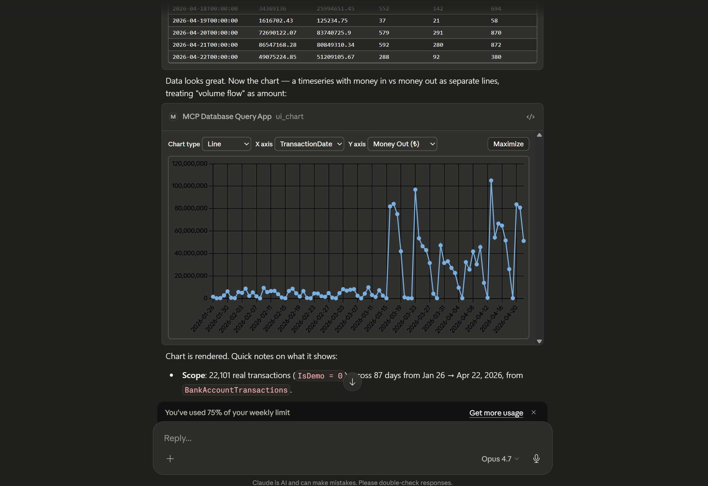

# MCP Database Query App

A mature Model Context Protocol **app** — not just a server — written in C# /
.NET 10 that lets LLM clients manage PostgreSQL and SQL Server databases
through Dapper, with a full interactive UI rendered directly inside the
client.



> Ask the model for a query. It runs the SQL, streams back results, and opens
> a live, sortable grid / filterable schema viewer / Chart.js visualisation
> *inside your MCP client* via the MCP Apps protocol — no separate window, no
> screenshots, no context loss.

## Highlights

- **MCP App, not just an MCP server** — ships a results grid, SQL
  builder, schema explorer, and Chart.js charting as MCP UI resources
  that hosts with MCP UI support (e.g. Claude Desktop) render inline.
- **Read-only by default** — writes and DDL are blocked unless a session
  explicitly opts in. Destructive tools ask for confirmation before
  running.
- **Encrypted credential storage** — saved database passwords are
  encrypted with AES-256-GCM using a master key you control.
- **Pagination & limits** — every query has a hard row cap with
  cursor-based paging for large result sets.
- **Both transports** — stdio (default) or HTTP/SSE.

## Quick install

### Option 1 — Drop-in `.mcpb` extension (Claude Desktop)

Grab the bundle for your platform and open it in Claude Desktop. The
`.mcpb` is a self-contained single-file package of the server, its .NET
runtime, and the UI assets — no `dotnet` or Node install on the host.
`.mcpb` is a Claude Desktop format; Claude Code and other hosts should
use Option 2.

| Platform              | Download                                                                                                                                                               |
| --------------------- | ---------------------------------------------------------------------------------------------------------------------------------------------------------------------- |
| Windows x64           | [mcp-database-query-app-win-x64-jit.mcpb](https://github.com/Trojaner/mcp-database-query-app/releases/latest/download/mcp-database-query-app-win-x64-jit.mcpb)         |
| Windows ARM64         | [mcp-database-query-app-win-arm64-jit.mcpb](https://github.com/Trojaner/mcp-database-query-app/releases/latest/download/mcp-database-query-app-win-arm64-jit.mcpb)     |
| macOS (Apple Silicon) | [mcp-database-query-app-osx-arm64-jit.mcpb](https://github.com/Trojaner/mcp-database-query-app/releases/latest/download/mcp-database-query-app-osx-arm64-jit.mcpb)     |
| macOS (Intel)         | [mcp-database-query-app-osx-x64-jit.mcpb](https://github.com/Trojaner/mcp-database-query-app/releases/latest/download/mcp-database-query-app-osx-x64-jit.mcpb)         |
| Linux x64             | [mcp-database-query-app-linux-x64-jit.mcpb](https://github.com/Trojaner/mcp-database-query-app/releases/latest/download/mcp-database-query-app-linux-x64-jit.mcpb)     |
| Linux ARM64           | [mcp-database-query-app-linux-arm64-jit.mcpb](https://github.com/Trojaner/mcp-database-query-app/releases/latest/download/mcp-database-query-app-linux-arm64-jit.mcpb) |

Double-click the `.mcpb`, or drag it into Claude Desktop's
**Settings → Extensions**. On first install, Claude Desktop will prompt
for the user-config values declared in `manifest.json` (master key,
read-only toggle, max result limit, UI toggle). Read-only is on by
default.

### Option 2 — `mcpServers` JSON config

For Claude Code, Cursor, Windsurf, or any other host that reads an
`mcpServers` block, point `command` at the extracted server binary (from
a `.mcpb` or a `dotnet publish` output):

```jsonc
{
  "mcpServers": {
    "database": {
      "command": "/absolute/path/to/mcp-database-query-app",
      "env": {
        "McpDatabaseQueryApp__Transport__Stdio__Enabled": "true",
        "McpDatabaseQueryApp__Transport__Http__Enabled": "false",
        "McpDatabaseQueryApp__ReadOnlyByDefault": "true",
        "McpDatabaseQueryApp__MaxResultLimit": "5000",
        "McpDatabaseQueryApp__Ui__Enabled": "true",
        "McpDatabaseQueryApp__Secrets__KeyRef": "ENV:MCP_DATABASE_QUERY_APP_MASTER_KEY",
        "MCP_DATABASE_QUERY_APP_MASTER_KEY": "<base64-encoded 32+ byte secret>"
      }
    }
  }
}
```

On Windows, point `command` at `mcp-database-query-app.exe`. Generate a
master key with `openssl rand -base64 32`.

**Claude Code** also accepts the same server via CLI — the flags below
produce an equivalent entry in your project's `.mcp.json`:

```bash
claude mcp add database \
  --env McpDatabaseQueryApp__ReadOnlyByDefault=true \
  --env McpDatabaseQueryApp__Ui__Enabled=true \
  --env McpDatabaseQueryApp__Secrets__KeyRef=ENV:MCP_DATABASE_QUERY_APP_MASTER_KEY \
  --env MCP_DATABASE_QUERY_APP_MASTER_KEY="$(openssl rand -base64 32)" \
  -- /absolute/path/to/mcp-database-query-app
```

## Features

- **Connection management** — open, ping, disconnect, and save
  pre-defined connection profiles.
- **Querying** — parameterised SELECTs, paged results, non-query
  execution, and EXPLAIN plans.
- **Schema introspection** — list schemas, tables, columns, keys,
  indexes, roles, and databases, with batched describe calls.
- **Saved scripts & notes** — store SQL snippets and attach notes to
  database objects.
- **Interactive UI** — sortable/filterable results grid, SQL builder,
  schema viewer, and charting, all rendered inside the MCP host.
- **Guided prompts** — `explore-database`, `safe-write`,
  `migrate-script`, `explain-slow-query` seed the model with a
  workflow.
- **Auto-completion** — resource and prompt-argument completion backed
  by a per-connection metadata cache.
- **Confirmations** — destructive operations are gated behind MCP
  elicitation prompts.

## Configuration

`appsettings.json` controls process-wide behaviour. Runtime metadata
(pre-defined connections, saved scripts, cached result sets) is stored in
a SQLite database under `%APPDATA%/McpDatabaseQueryApp/mcp-database-query-app.db`. Passwords are
encrypted with AES-256-GCM using a key resolved from
`McpDatabaseQueryApp:Secrets:KeyRef` (`UserSecrets:…`, `Env:…`, `File:…`, or
`Literal:…`).

```jsonc
{
  "McpDatabaseQueryApp": {
    "MetadataDbPath": "%APPDATA%/McpDatabaseQueryApp/mcp-database-query-app.db",
    "DefaultResultLimit": 500,
    "MaxResultLimit": 50000,
    "AllowDisableLimit": true,
    "ReadOnlyByDefault": true,
    "Transport": {
      "Stdio": { "Enabled": true },
      "Http":  { "Enabled": false, "Urls": "http://127.0.0.1:5218" }
    },
    "Ui": { "Enabled": true },
    "Secrets": { "KeyRef": "UserSecrets:McpDatabaseQueryApp:MasterKey" }
  }
}
```

Every setting above is overridable via environment variable using the
double-underscore convention (`McpDatabaseQueryApp__ReadOnlyByDefault=true`).

## Build from source

Requires the .NET 10 SDK (10.0.201+) and Node.js 18+.

```bash
dotnet build
dotnet test

# stdio (default)
dotnet run --project src/McpDatabaseQueryApp.Server

# HTTP/SSE
McpDatabaseQueryApp__Transport__Http__Enabled=true dotnet run --project src/McpDatabaseQueryApp.Server
```
